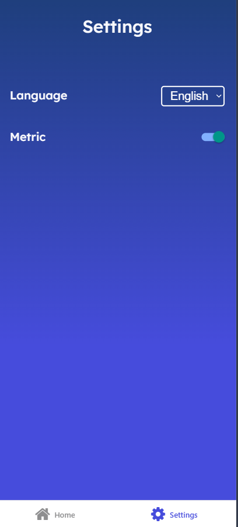

# 🌦️ Weather App

A simple weather app built with **React Native** and **Expo**.

## 📷 Screenshots
<div>


</div>
## 📦 Technologies Used
- React Native
- Expo

 API: OpenWeather API

## 🚀 Installation
1. Clone the repository
3. Navigate to the project folder:
   ```sh
   cd weather-app
   ```
4. Install dependencies:
   ```sh
   npm install
   ```
5. Add your OpenWeather API Key in .env

## ▶️ Run the App
Start Expo:
```sh
npx expo start
```

## 📡 Features
- Search for the weather of any city
- Change the language (English, Italian)
- Choose the unit of measurement (Celsius, Fahrenheit)
